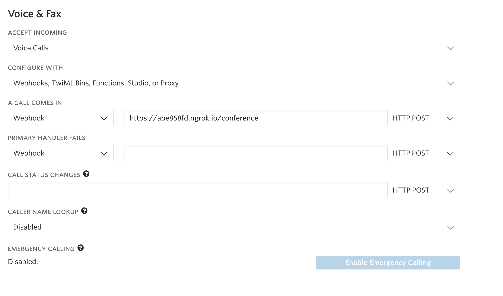

# Rapid Response Kit: Building Conferencing and Broadcasting with Twilio. Level: Intermediate. Powered by Twilio - Spark


> We are currently in the process of updating this sample template. If you are encountering any issues with the sample, please open an issue at [github.com/twilio-labs/code-exchange/issues](https://github.com/twilio-labs/code-exchange/issues) and we'll try to help you.

An example application implementing an disaster response kit that allows an organizer to instantly communicate with volunteers.

[Read the full tutorial here](https://www.twilio.com/docs/tutorials/walkthrough/conference-broadcast/java/spark)!

### Run the application

1. Clone the repository and `cd` into it.
1. The application uses Gradle to manage dependencies. A wrapper is included in the
   repository so, if you don't have Gradle installed on the system, you can use `./gradlew` to
   execute any gradle task.
1. Copy the sample configuration file sample file.

   ```bash
   $ cp .env.example .env
   ```
1. Edit the sample configuration file `.env` and edit it to match your configuration.

   Once you have edited the `.env` file, if you are using a unix operating system,
   just use the `source` command to load the variables into your environment:

   ```bash
   $ source .env
   ```

   If you are using a different operating system, make sure that all the
   variables from the .env file are loaded into your environment.

   You can find your `TWILIO_ACCOUNT_SID` and `TWILIO_AUTH_TOKEN` under
   your
   [Twilio Account Settings](https://www.twilio.com/user/account/settings).
   You can buy Twilio phone numbers at [Twilio numbers](https://www.twilio.com/user/account/phone-numbers/search)
   `TWILIO_NUMBER` should be set to the phone number you purchased above.
   `TWILIO_RR_NUMBER` should be set to a Twilio number too.

1. Configure Twilio to call your webhooks
   You will also need to configure Twilio to call your application when calls are received.

   You will need to provision at least one Twilio number with voice capabilities
   so the application's users can join conference calls. You can buy a number [right
   here](https://www.twilio.com/user/account/phone-numbers/search). Once you have
   a number you need to configure your number to work with your application. Open
   [the number management page](https://www.twilio.com/user/account/phone-numbers/incoming)
   and open a number's configuration by clicking on it.

   Remember that the number where you change the voice webhooks must be the same one you set on
   the `TWILIO_RR_NUMBER` environment variable.

   

1. Run the application using Gradle.

   ```bash
   $ ./gradlew run
   ```
   This will run the embedded spark application server that uses port 4567 by default.
   If you want to run the application using a different port, you must set the environment
   variable `PORT` to the port number you want to use.
1. Expose the application to the wider Internet using [ngrok](https://ngrok.com/)

   ```bash
   $ ngrok http 4567
   ```
   Once you have started ngrok, update your Twilio's number voice URL
   setting to use your ngrok hostname, so it will look something like
   this:

   ```
   http://<your-ngrok-subdomain>.ngrok.io/conference
   ```

### Dependencies

This application uses this Twilio helper library:
* [twilio-java](https://github.com/twilio/twilio-java)

### Run the tests

1. Run at the top-level directory:

   ```bash
   $ ./gradlew check
   ```
   
   
## Meta

* No warranty expressed or implied. Software is as is. Diggity.
* The CodeExchange repository can be found [here](https://github.com/twilio-labs/code-exchange/).
* [MIT License](http://www.opensource.org/licenses/mit-license.html)
* Lovingly crafted by Twilio Developer Education.
